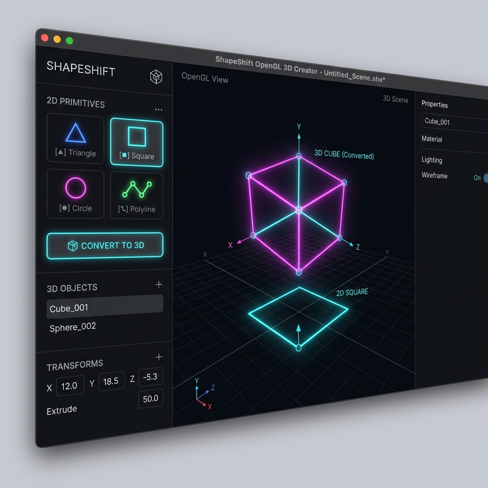

# 2D to 3D Shape Transformer

A modern C++ Qt and OpenGL application that allows users to interactively draw, transform, and convert 2D geometric shapes into fully operational 3D objects.

## Overview & Features

- **Interactive 2D Shapes**: Generate primitives including Triangles, Squares, Rectangles, and Circles.
- **Precision Object Controls**:
  - **Translate**: Left-click and drag near the center of any shape to fluidly move it.
  - **Scale via Vertex Anchoring**: Left-click and drag a specific shape corner. The application natively anchors the opposite vertex, uniformly scaling the object while preserving its perfect structural geometry (a square stays a square).
- **2D to 3D Conversion**: Instantly transform your flat polygon into a 3D extrusion.
  - **Dynamic 3D Rotation**: Right-click and drag across the viewport to rotate your extruded 3D model across its X and Y axes in real-time!

## Build Requirements

- **CMake** (3.16+)
- **Qt 6** (Core, GUI, Widgets, OpenGLWidgets)
- A modern **C++17** compatible compiler.

## Setup and Installation

1. Open the project folder in Visual Studio, Qt Creator, or VS Code.
2. Allow CMake to configure the environment (ensure your Qt6 Path is available to CMake).
3. Select `2DShapesTransform` as your build and run target.
4. Build the executable.

## Usage Guide

1. **Select** your desired shape from the top drop-down menu.
2. **Left-click** anywhere tightly in the canvas to spawn your shape.
3. **Drag** from the center to translate it, or grab a highlighted **vertex** to symmetrically scale it.
4. Click **Convert to 3D**.
5. **Right-click and drag** to fully rotate and inspect the 3D model.
