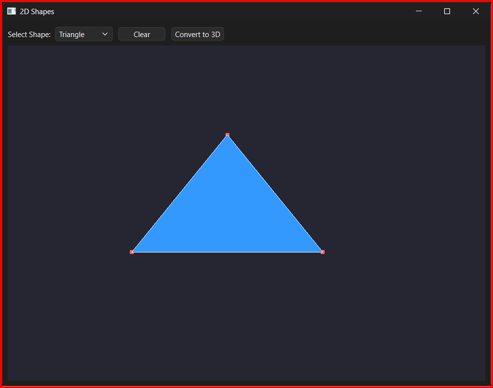
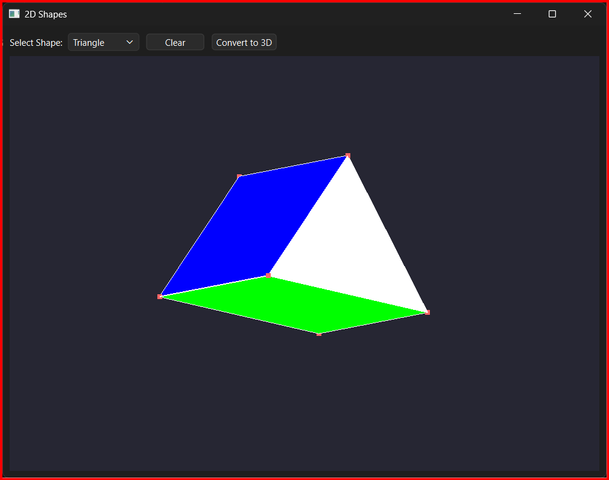
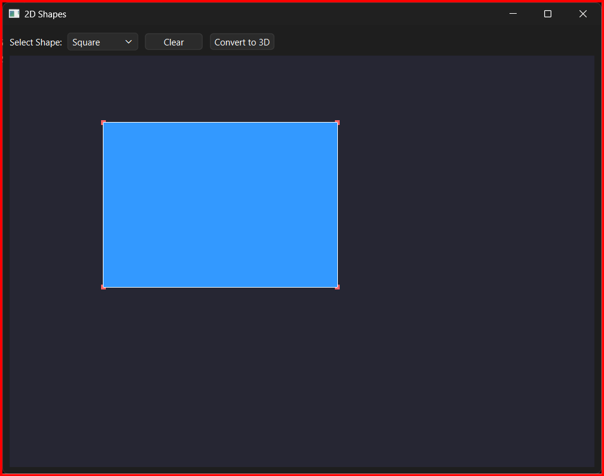
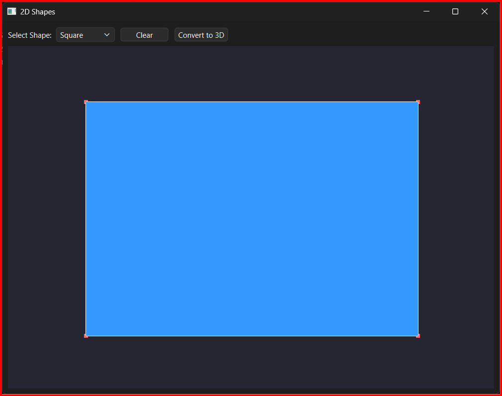
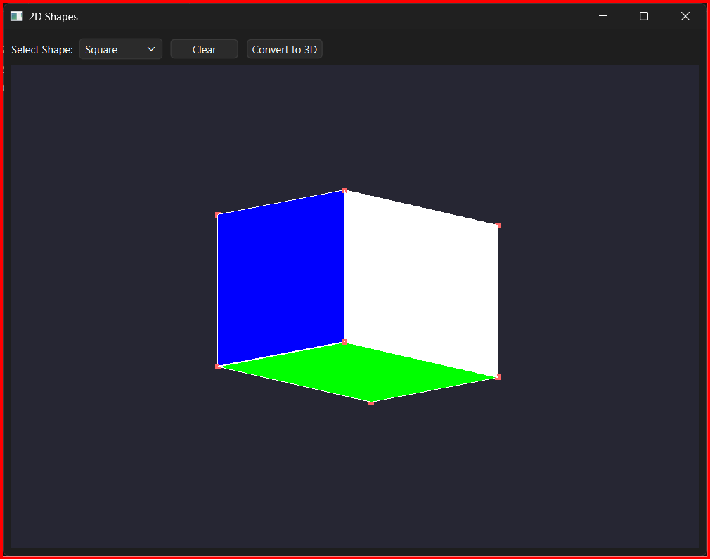
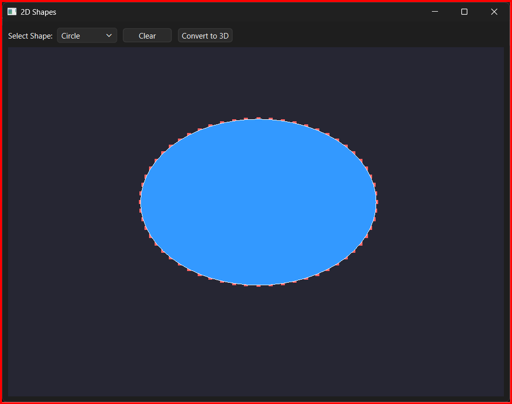
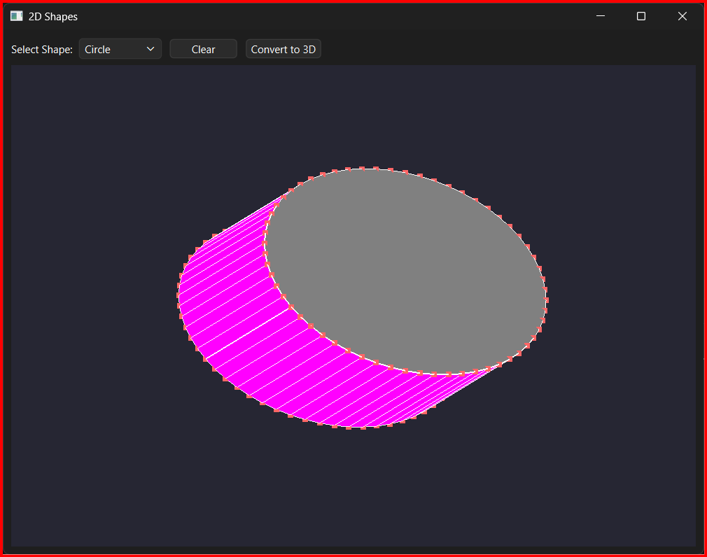

# 🎯 2D to 3D Shape Transformer - FreeCAD

A modern C++ Qt and OpenGL application that allows users to interactively draw, transform, and convert 2D geometric shapes into fully functional 3D objects.

---

## 🚀 Overview & Features

* **Interactive 2D Shapes**: Generate primitives including triangles, squares, rectangles, and circles.

* **Precision Object Controls**:
  * **Translate**: Left-click and drag near the center of any shape to move it smoothly.
  * **Scale via Vertex Anchoring**: Left-click and drag a specific corner. The opposite vertex remains fixed, allowing uniform scaling while preserving shape geometry.

* **2D to 3D Conversion**:
  * Instantly convert flat polygons into 3D extrusions.

* **Dynamic 3D Rotation**:
  * Right-click and drag to rotate along the X and Y axes.

---

## 📸 Output Screens

### 🔺 Triangle (2D)

### 🔺 Triangle (3D)

### 🔷 Square (2D)

### 🔶 Rectangle (2D)

### 🧊 Cube (3D Output)

### 🔵 Circle (2D)

### 🔵 Cylinder (3D Extrusion)

---

## 🛠️ Build Requirements

* Qt 6 (Core, GUI, Widgets, OpenGLWidgets)
* Qt Creator (recommended) or Visual Studio with Qt support
* C++17 compatible compiler

---

## ⚙️ Setup & Installation

### Using Qt Creator (.pro file)

1. Open Qt Creator  
2. Click **Open Project**  
3. Select `2DShapesTransform.pro`  
4. Configure kit (Qt 6)  
5. Click **Build & Run**

### Using Visual Studio (Qt Extension)

1. Open Visual Studio  
2. Install Qt VS Tools  
3. Open `.pro` file or convert it into a Visual Studio project  
4. Build and run  

---

## 🎮 Usage Guide

* Select a shape from the dropdown  
* Left-click to create  
* Drag center → move  
* Drag vertex → scale  
* Click **Convert to 3D**  
* Right-click + drag → rotate  

---
